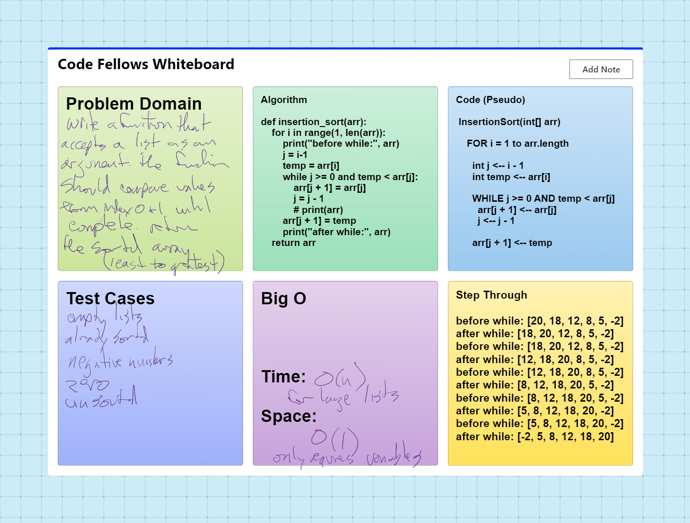

# Inserstion Sort
Ensure your complete code solution follows the standard requirements.

## Challenge
Review the pseudocode below, then trace the algorithm by stepping through the process with the provided sample array. Document your explanation by creating a blog article that shows the step-by-step output after each iteration through some sort of visual.

Once you are done with your article, code a working, tested implementation of Insertion Sort based on the pseudocode provided.

You may review an example document HERE

Pseudocode
  InsertionSort(int[] arr)

    FOR i = 1 to arr.length

      int j <-- i - 1
      int temp <-- arr[i]

      WHILE j >= 0 AND temp < arr[j]
        arr[j + 1] <-- arr[j]
        j <-- j - 1

      arr[j + 1] <-- temp

## Whiteboard Process

## Approach & Efficiency
DRY - Don't Repeat Yourself
Separate code into blocks

Time: O(n)
SPace: O(1)

## API
none

Please visit [here](https://docs.google.com/document/d/1fQo_JxA4qX3FmxK_TS44bJn9GExjZH9E/edit?usp=sharing&ouid=112261325791309153331&rtpof=true&sd=true) for best viewing results with images.

Insertion Sort
Insertion sort is a simple sorting algorithm that sorts an array by repeatedly taking one element from the array and inserting it into its correct position in a sorted sub-array. It compares the current element with the previous elements and move to left until it finds the correct position for that element. This process is repeated for all elements in the array.
Pseudocode

Trace
Given:

Pass 1

i is initialized to 1. The first element of the array, arr[0] is already in its correct position, so it is not compared or moved.
j is initialized to i-1, which is 0. temp is set to arr[i], which is arr[1], or 18.
The while loop starts. j is not less than 0, and 18 is not less than 20, so the loop does not execute.
arr[j+1] is set to temp, which is 18. So the first two elements of the array are now [20, 18]
 
Pass 2

i is incremented to 2. j is set to 1, and temp is set to arr[2], which is 12.
The while loop starts again. This time, j is not less than 0, but 12 is less than 18, so the loop executes. arr[j+1] is set to arr[j], so arr[2] is set to 18. j is decremented to 0.
The while loop starts again. j is not less than 0, and 12 is less than 20, so the loop executes. arr[j+1] is set to arr[j], so arr[1] is set to 20. j is decremented to -1.
The while loop exits because j is now less than 0. arr[j+1] is set to temp, which is 12, so the array is now [12, 20, 18].

Pass 3

i is incremented to 3. j is set to 2, and temp is set to arr[3], which is 8.
The while loop starts. j is not less than 0, and 8 is less than 12, so the loop executes. arr[j+1] is set to arr[j], so arr[3] is set to 12. j is decremented to 1.
The while loop starts again. j is not less than 0, and 8 is less than 18, so the loop executes. arr[j+1] is set to arr[j], so arr[2] is set to 18. j is decremented to 0.
The while loop starts again. 8 is less than 20, so the loop executes. arr[j+1] is set to arr[j], so arr[1] is set to 20. j is decremented to -1.
The while loop exits because j is now less than 0. arr[j+1] is set to temp, which is 8, so the array is now [8, 12, 18, 20].

 
Pass 4

i is incremented to 4. j is set to 3, and temp is set to arr[4], which is 5.
The while loop starts. j is not less than 0, and 5 is less than 8, so the loop executes. arr[j+1] is set to arr[j], so arr[4] is set to 8. j is decremented to 2.
The while loop starts again. j is not less than 0, and 5 is less than 12, so the loop executes. arr[j+1] is set to arr[j], so arr[3] is set to 12. j is decremented to 1.
The while loop starts again. 5 is less than 18, so the loop executes. arr[j+1] is set to arr[j], so arr[2] is set to 18. j is decremented to 0.
The while loop starts again. 5 is less than 20, so the loop executes. arr[j+1] is set to arr[j], so arr[1] is set to 20. j is decremented to -1.
The while loop exits because j is now less than 0. arr[j+1] is set to temp, which is 5, so the array is now [5, 8, 12, 18, 20].

Pass 5

i is incremented to 5. j is set to 4, and temp is set to arr[5], which is -2.
The while loop starts. j is not less than 0, and -2 is less than 5, so the loop executes. arr[j+1] is set to arr[j], so arr[5] is set to 5. j is decremented to 3.
The while loop starts again. j is not less than 0, and -2 is less than 8, so the loop executes. arr[j+1] is set to arr[j], so arr[4] is set to 8. j is decremented to 2.
The while loop starts again. j is not less than 0, and -2 is less than 12, so the loop executes. arr[j+1] is set to arr[j], so arr[3] is set to 12. j is decremented to 1.
The while loop starts again. j is not less than 0, and -2 is less than 18, so the loop executes. arr[j+1] is set to arr[j], so arr[2] is set to 18. j is decremented to 0.
The while loop starts again. j is not less than 0, and -2 is less than 20, so the loop executes. arr[j+1] is set to arr[j], so arr[1] is set to 20. j is decremented to -1.
The while loop exits because j is now less than 0. arr[j+1] is set to temp, which is -2, so the array is now [-2, 5, 8, 12, 18, 20].

Result:
The for loop has now completed its iterations and the function returns the sorted array [-2, 5, 8, 12, 18, 20].

Efficiency:
Time complexity: O(n^2) (in the worst and average case) and O(n) in the best case.
This is because the while loop, which is responsible for finding the correct position for the current element, can iterate up to n times for each element in the array. The best case occurs when the array is already sorted, in this case, the while loop will not execute at all and the algorithm will have a linear time complexity of O(n).
Space complexity: O(1)
It performs sorting in-place and does not require any additional data structures.
