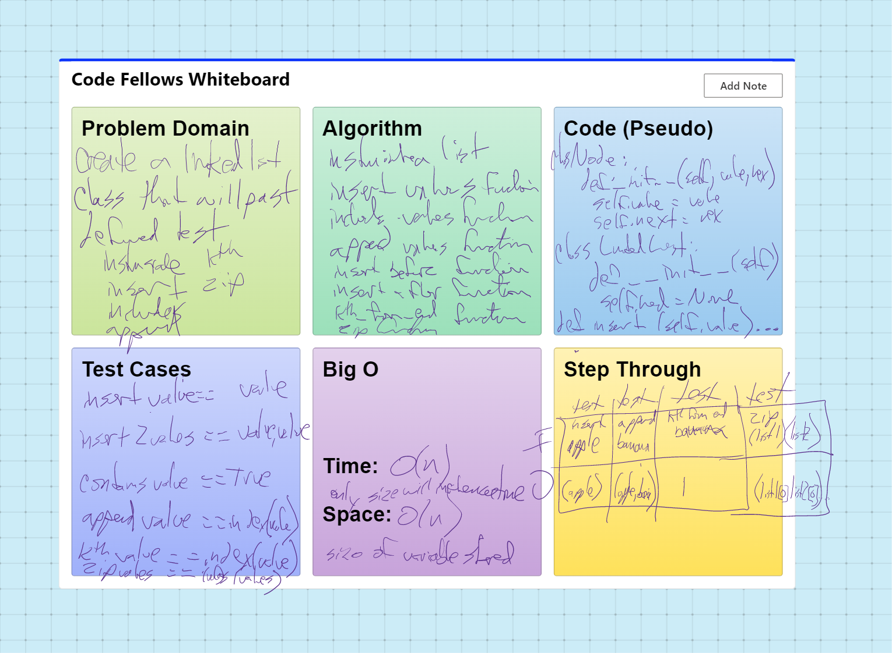

# Linked List Zip
Write tests for the following scenarios, and any other cases that help you ensure your code is working as expected.

def test_even_length():
    list_a = LinkedList()
    for value in reversed([1, 2, 3]):
        list_a.insert(value)

    list_b = LinkedList()
    for value in reversed(["a", "b", "c"]):
        list_b.insert(value)

    actual = zip_lists(list_a, list_b)
    expected = LinkedList()
    for value in reversed([1, "a", 2, "b", 3, "c"]):
        expected.insert(value)

    assert str(actual) == str(expected)

# @pytest.mark.skip("TODO")
def test_a_shorter():
    list_a = LinkedList()
    for value in reversed([1, 2]):
        list_a.insert(value)

    list_b = LinkedList()
    for value in reversed(["a", "b", "c"]):
        list_b.insert(value)

    actual = zip_lists(list_a, list_b)
    expected = LinkedList()
    for value in reversed([1, "a", 2, "b", "c"]):
        expected.insert(value)

    assert str(actual) == str(expected)

# @pytest.mark.skip("TODO")
def test_b_shorter():
    list_a = LinkedList()
    for value in reversed([1, 2, 3]):
        list_a.insert(value)

    list_b = LinkedList()
    for value in reversed(["a", "b"]):
        list_b.insert(value)

    actual = zip_lists(list_a, list_b)
    expected = LinkedList()
    for value in reversed([1, "a", 2, "b", 3]):
        expected.insert(value)

    assert str(actual) == str(expected)

# @pytest.mark.skip("TODO")
def test_a_empty():
    list_a = LinkedList()
    list_b = LinkedList()
    for value in reversed(["a", "b", "c"]):
        list_b.insert(value)

    actual = zip_lists(list_a, list_b)
    expected = LinkedList()
    for value in reversed(["a", "b", "c"]):
        expected.insert(value)
    assert str(actual) == str(expected)

# @pytest.mark.skip("TODO")
def test_b_empty():
    list_a = LinkedList()
    for value in reversed([1, 2, 3]):
        list_a.insert(value)
    list_b = LinkedList()
    actual = zip_lists(list_a, list_b)
    expected = LinkedList()
    for value in reversed([1, 2, 3]):
        expected.insert(value)
    assert str(actual) == str(expected)

## Challenge
Write a function called zip lists
Arguments: 2 linked lists
Return: New Linked List, zipped as noted below
Zip the two linked lists together into one so that the nodes alternate between the two lists and return a reference to the the zipped list.
Try and keep additional space down to O(1)
You have access to the Node class and all the properties on the Linked List class as well as the methods created in previous challenges.

## Whiteboard Process

## Approach & Efficiency
DRY - Don't Repeat Yourself
Separate code into blocks

Time: O(n)
SPace: O(n)

## API
none

