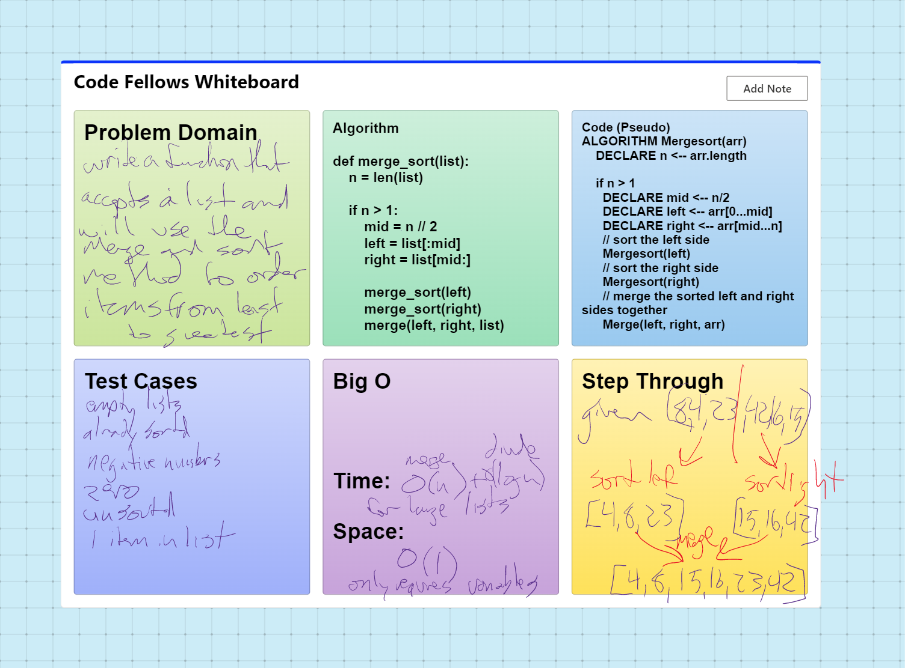

# Merge Sort
Ensure your complete code solution follows the standard requirements.

## Challenge
Review the pseudocode below, then trace the algorithm by stepping through the process with the provided sample array. Document your explanation by creating a blog article that shows the step-by-step output after each iteration through some sort of visual.

Once you are done with your article, code a working, tested implementation of Insertion Sort based on the pseudocode provided.

Pseudocode
  ALGORITHM Mergesort(arr)
    DECLARE n <-- arr.length

    if n > 1
      DECLARE mid <-- n/2
      DECLARE left <-- arr[0...mid]
      DECLARE right <-- arr[mid...n]
      // sort the left side
      Mergesort(left)
      // sort the right side
      Mergesort(right)
      // merge the sorted left and right sides together
      Merge(left, right, arr)

ALGORITHM Merge(left, right, arr)
    DECLARE i <-- 0
    DECLARE j <-- 0
    DECLARE k <-- 0

    while i < left.length && j < right.length
        if left[i] <= right[j]
            arr[k] <-- left[i]
            i <-- i + 1
        else
            arr[k] <-- right[j]
            j <-- j + 1

        k <-- k + 1

    if i = left.length
       set remaining entries in arr to remaining values in right
    else
       set remaining entries in arr to remaining values in left

## Whiteboard Process

## Approach & Efficiency
DRY - Don't Repeat Yourself
Separate code into blocks

Time: O(n) O(logn)
SPace: O(n)

## API
none

Please visit [here](https://docs.google.com/document/d/1HRBo4Qsz0epj6SPSsVE5iW8EJzsNh2Zr/edit?usp=sharing&ouid=112261325791309153331&rtpof=true&sd=true) for best viewing results with images.

Merge Sort
The merge_sort function is a divide and conquer algorithm that sorts an array by recursively dividing it into two halves, sorting each half, and then merging the sorted halves back together. The merge sort algorithm repeatedly splits the input array in half until the individual sub-arrays have only one element. Then it merges these sub-arrays back together in a sorted order. The merge function is used to merge the two sorted sub-arrays back into the original array.  The final output is a sorted version of the original array.
Pseudocode

Trace
Given:

Pass 1 (sort left):
left before sort: [8, 4, 23] and right before sort: [42, 16, 15]
list is split into 2 pieces (n//2)
left before sort: [8] and right before sort: [4, 23]
left len !> 1, so stop sort left. right len is still > 1, right is split in half
left before sort: [4] and right before sort: [23]
left and right !>1, time to merge
left before merge: [4] and right before merge: [23]
left[0] is < right[0]
list after merge: [4, 23]
so sorted list is created left[0], then right[0]
left after merge: [8] and right after merge: [4, 23]
left[0] is > right[0], so sorted list is created right[0], left[0], the right[1]
list after merge: [4, 8, 23]
sorted left list is complete, now to sort original right split
Pass 2 (sort right)
left before sort: [42] and right before sort: [16, 15]
left len !> 1, so stop sort left. right len is still > 1, right is split in half
left before sort: [16] and right before sort: [15]
left and right !>1, time to merge
left after sort: [16] and right after sort: [15]
left and right !>1, time to merge
left before merge: [16] and right before merge: [15]
left[0] is > right[0]
list after merge: [15, 16]
so sorted list is created right[0], then left[0]
left after merge: [42] and right after merge: [15, 16]
left[0] is > right[0], so sorted list is created right[0], left[0], the right[1]
list after merge: [15, 16, 42]
sorted left list is complete
left after sort: [4, 8, 23] and right after sort: [15, 16, 42]
now to merge left and right from original split
Pass 3 (merge left and right):
left after merge: [4, 8, 23] and right after merge: [15, 16, 42]
left[0] is < right[0], so sorted list is created left[0], left[1], then right[0], etc.
list after merge: [4, 8, 15, 16, 23, 42]
sorted and merged list is returned

Efficiency:
Time complexity: O(nlog(n))
The divide step has a logarithmic time complexity of O(log(n)) because it repeatedly divides the input array into two sub-arrays until the sub-arrays have only one element.  The merge step has a linear time complexity of O(n) because it needs to compare and merge n elements.
Space complexity: O(n)
It needs to create two sub-arrays for each recursive call, as well as the original array.
