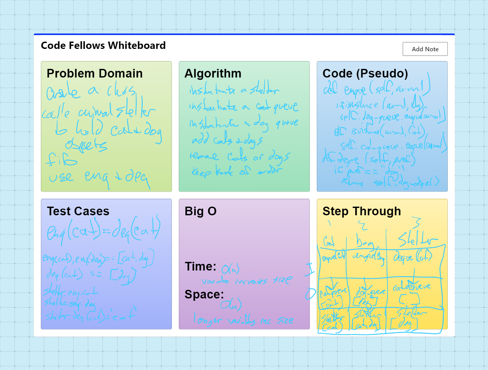

# stack-queue-animal-shelter
Create a class called AnimalShelter which holds only dogs and cats.
The shelter operates using a first-in, first-out approach.
Implement the following methods:
enqueue
Arguments: animal
animal can be either a dog or a cat object.
dequeue
Arguments: pref
pref can be either "dog" or "cat"
Return: either a dog or a cat, based on preference.
If pref is not "dog" or "cat" then return null.

## Challenge

First-in, First out Animal Shelter.

## Whiteboard Process

## Approach & Efficiency
DRY - Don't Repeat Yourself
Separate code into blocks

Time: O(n)
SPace: O(n)

## API
none

