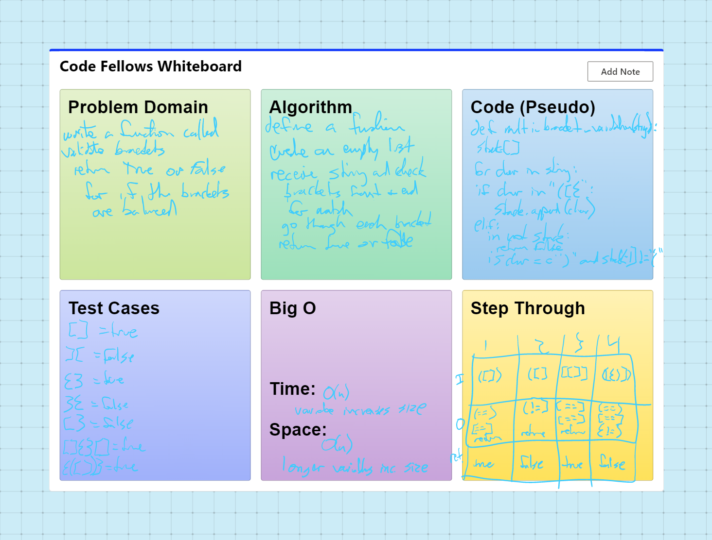

# stack-queue-animal-shelter
Write a function called validate brackets
Arguments: string
Return: boolean
representing whether or not the brackets in the string are balanced
There are 3 types of brackets:

Round Brackets : ()
Square Brackets : []
Curly Brackets : {}

## Challenge

Multi-bracket Validation.

## Whiteboard Process

## Approach & Efficiency
DRY - Don't Repeat Yourself
Separate code into blocks

Time: O(n)
SPace: O(n)

## API
none

