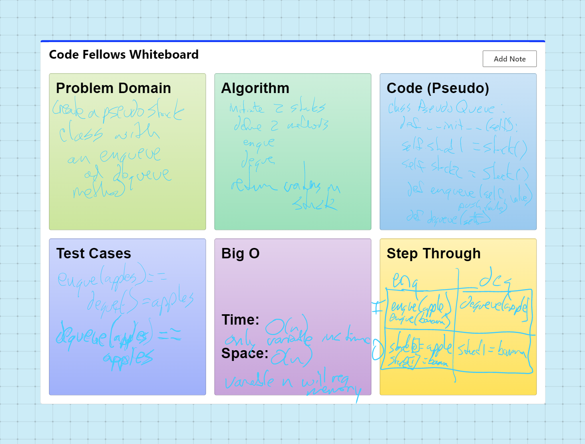

# Linked List Zip
Write tests for the following scenarios, and any other cases that help you ensure your code is working as expected.

# @pytest.mark.skip("TODO")
def test_enqueue_one():
    pq = PseudoQueue()
    pq.enqueue("apples")
    actual = pq.dequeue()
    expected = "apples"
    assert actual == expected

# @pytest.mark.skip("TODO")
def test_enqueue_two():
    pq = PseudoQueue()
    pq.enqueue("apples")
    pq.enqueue("bananas")

    actual = pq.dequeue()
    expected = "apples"
    assert actual == expected

    actual = pq.dequeue()
    expected = "bananas"
    assert actual == expected

# @pytest.mark.skip("TODO")
def test_enqueue_dequeue_enqueue_dequeue():
    pq = PseudoQueue()
    pq.enqueue("apples")
    pq.enqueue("bananas")

    pq.dequeue()

    pq.enqueue("cucumbers")
    pq.enqueue("dates")

    actual = [pq.dequeue(), pq.dequeue(), pq.dequeue()]

    expected = ["bananas", "cucumbers", "dates"]

    assert actual == expected

## Challenge
Create a new class called pseudo queue.
Do not use an existing Queue.
Instead, this PseudoQueue class will implement our standard queue interface (the two methods listed below),
Internally, utilize 2 Stack instances to create and manage the queue
Methods:
enqueue
Arguments: value
Inserts a value into the PseudoQueue, using a first-in, first-out approach.
dequeue
Arguments: none
Extracts a value from the PseudoQueue, using a first-in, first-out approach.
NOTE: The Stack instances have only push, pop, and peek methods. You should use your own Stack implementation. Instantiate these Stack objects in your PseudoQueue constructor.

## Whiteboard Process

## Approach & Efficiency
DRY - Don't Repeat Yourself
Separate code into blocks

Time: O(n)
SPace: O(n)

## API
none

